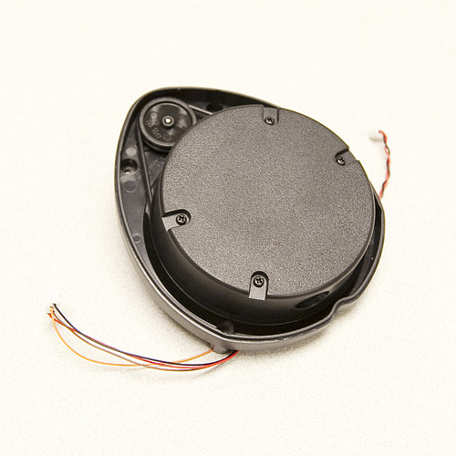

# Neato XV-11 LIDAR - Simple to run, no dependencies

This code was put together to interface with the Neato XV-11 LIDAR. Please see reference section bellow for resources I used to put this together. When the LIDAR is spinning between 180 and 310 RPM it begins transmitting useful data. That data is collected and upon a keyboard interrupt (CTRL+C) the data will be plotted to a graph and saved to the working directory.

# Wiring:
## Motor (2 pin):
    Black --> Ground
    Red --> 22ohm --> 3.3v (or just 3.3v)
## Sensor (4 pin JST):
    Red --> 3.3v
    Brown (RX) --> RX (not a mistake, but may need to be reversed in different setups. See bellow about the serial connection)
    Orange (TX) --> TX
    Black --> Ground
## Serial to Computer:
* com_port = (look up in Arduino IDE)
* baud_rate = 115200
* I used an Arduino UNO with a jumper between the "RESET" and "GND" as my serial adapter. The COM port can then be read from the list on COMs in the Arduino IDE.

# Running The Code:
    1. CD to the directory downloaded from GIT
    2. run "python XV-11_main.py"
    3. Wait for data to be collected
    4. Press CTRL+C
    5. The image "LIDAR_OUT.PNG" will be saved into the current directory

# Notes:
    1. The motor is not be controlled via PWM, between [3.3v or 22ohm+3.3v] the correct speed is reached.
    2. The error checking bits are not used.
    3. Data with 0x80/250_10 type errors are discarded.

# Dependencies (none that need to be installed):
## PySerial
Included

## matplotlib
Included in python
if not (pip install matplotlib)

# Additional Notes After Working With LIDAR for 6 Months:
1. When the LIDAR reads things bellow 0.1 m or past 6 m the result is either the lidar submits error packets or stale data. The stale data occurs in the case that something appears in its range and then is removed and only open space remains (>6 m).

#References
* Outline of the communication structure: <https://xv11hacking.wikispaces.com/LIDAR+Sensor>
* Translate data to real world results: <https://github.com/Xevel/NXV11>